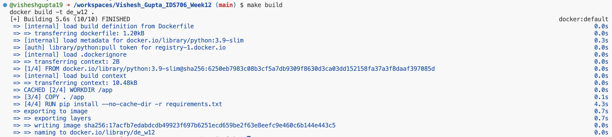
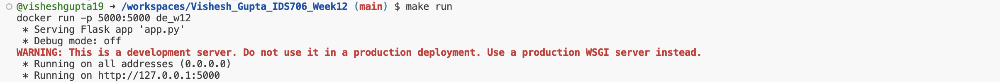

# Vishesh_Gupta_IDS706_Week12

[](https://github.com/nogibjj/Vishesh_Gupta_IDS706_Week12/actions/workflows/cicd.yml)

# Link to the Docker Image

You can find the docker image here [on Docker Hub](https://hub.docker.com/r/visheshgupta19/de_w12).

This repository demonstrates a simple Python application that is containerized using Docker. The application is built, run, and managed using Docker commands and CI/CD workflows.

## Features
- **Dockerized Python Application**: A Python Flask application containerized for ease of deployment.
- **CI/CD Integration**: Docker images are built in a CI/CD pipeline and pushed to a container registry (e.g., Docker Hub).
- **Makefile for Automation**: Simplifies Docker build and run commands.

---

## Prerequisites
1. Install Docker: [Get Docker](https://www.docker.com/get-started)
2. Install `make` utility (optional, for Makefile usage).

---

## Getting Started

### 1. Clone the Repository
```bash
git clone https://github.com/nogibjj/Vishesh_Gupta_IDS706_Week12.git
cd Vishesh_Gupta_IDS706_Week12
```

### 2. Build the Docker Image
Use the Makefile for a streamlined build process:
```bash
make build
```


### 3. Run the Container
Run the container using the following Makefile command:
```bash
make run
```



The application will be accessible at [http://127.0.0.1:5000](http://127.0.0.1:5000).


## File Structure

```
Vishesh_Gupta_IDS706_Week12/
├── Dockerfile          # Instructions for containerizing the app
├── requirements.txt    # Python dependencies
├── app.py              # Main Python Flask application
├── Makefile            # Automation for Docker commands
└── README.md           # Project documentation
```

## Deployment to Docker Hub

1. Authenticate to Docker Hub
```bash
docker login
```

2. Tag the Image
```bash
docker tag de_w12 <your-dockerhub-username>/de_w12:latest
```

3. Push the Image
```bash
docker push <your-dockerhub-username>/de_w12:latest
```
